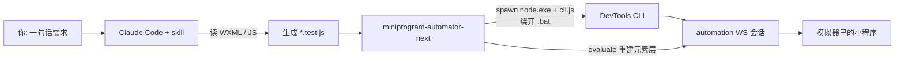

# miniprogram-auto-test

一句话生成微信小程序自动化测试脚本：AI 读你的 WXML + JS，产出能直接跑的测试脚本；顺手修掉官方 SDK 已经坏掉的两处。

[](https://www.npmjs.com/package/miniprogram-automator-next)
[](LICENSE)
[](packages/miniprogram-automator-next/package.json)
[](https://github.com/Zi-Yi-Ming/miniprogram-auto-test/stargazers)
[](https://github.com/Zi-Yi-Ming/miniprogram-auto-test/issues)

## 简介

微信官方的 [`miniprogram-automator`](https://www.npmjs.com/package/miniprogram-automator) 是小程序自动化测试唯一的技术地基，但它是个**裸 SDK**：每个用例都得你手写「选哪个元素、点什么、断言什么」。而且它 **2023-11 之后就没更新了**，工具却一直在往前走。

本项目是两件东西：

| 交付物 | 是什么 | 怎么用 |
|---|---|---|
| **skill** | 一个 Claude Code skill，让 AI 读懂你的页面代码，按一句话需求生成可运行的 `*.test.js` | 复制 `skill/` 到 `~/.claude/skills/` |
| **修复包** | [`miniprogram-automator-next`](https://www.npmjs.com/package/miniprogram-automator-next)，官方 SDK 的适配层，把下面两处坏掉的东西修了 | `npm i -D miniprogram-automator-next` |

装好之后，在你的小程序项目里对 Claude Code 说一句话：

> 帮我测一下 `pages/home/index`，点登录按钮，断言按钮渲染出来并且 handler 被调起。

它会读 `pages/home/index.wxml` + `.ts`，生成脚本并给出运行命令。

## 🔴 两个实测结论（本项目真正的价值）

实测环境：**DevTools 2.01.2510290 / 基础库 3.17.0 / Node v24.12.0 / Windows 11**。

### ① 官方文档教的主要用法已经跑不通

`automation` 协议的 **`Page.*` 命令族整族不响应** —— `page.data()` / `page.setData()` / `page.callMethod()` / `page.$()` / `page.$$()` / xpath 系列**全部超时**；`Element.*` 因为拿不到 element handle 而整族不可达。

也就是官方文档首页那句 `page.$('.btn').tap()`，死了。

活着的是 `App.*` 和 `Tool.*` 两族，其中 `miniProgram.evaluate()` 能在小程序运行时执行任意代码。**修复包把元素层能力整个重建在 `evaluate` 之上** —— 查元素、读写 data、点击、输入、等待，API 形状尽量贴近官方，换掉底层实现。

### ② `launch()` 在 Windows + Node ≥18.20 上必炸

Node 修了 CVE-2024-27980（BatBadBut）之后，不带 `shell:true` 地 `spawn()` 一个 `.bat` 会抛 `EINVAL(-4071)`。官方 `Launcher` 正好这么干。更坑的是它把这个失败**错报成**：

```
Failed to launch wechat web devTools, please make sure cliPath is correctly specified
```

于是你会去反复检查一个完全没问题的路径。

修法很干净：`cli.bat` 的全部内容就是 `"%~dp0.\node.exe" "%~dp0.\cli.js" %*`，所以直接 spawn 同目录的 `node.exe` + `cli.js` —— 绕开 `.bat`，且**不需要** `shell:true`（不重新打开 CVE 修掉的那个注入面）。

> 官方 SDK 的 `repository` 字段指向腾讯内网域名（`git.code.oa.com`），**没有公开仓库，物理上没法提 PR**。这就是修复包存在的原因。

## 为什么用它

定位是**开发者本机的 AI 测试助手**：把「手写 automator 脚本」变成「一句话生成」。收益：

- **写用例的成本从「查 API + 试选择器」降到一句话**：AI 直接读 WXML 拿 class、`wx:if` 条件、`bindtap` handler 名，不用你人肉翻代码
- **能把页面强行摆到想测的状态**：`setData` 一句话就位，测一个错误分支不用先走完整前置流程
- **确定性、可提交进仓库**：产出的是普通 `node` 脚本，能重复跑、能进 git、能 code review，不是一次性对话
- **两个坑已经替你踩过**：`spawn EINVAL` 和 `Page.*` 全死，都是要花几小时才能定位的问题，修复包直接绕过

### 为什么「AI 读 WXML」是技术必要条件，不是包装卖点

因为 `Element.tap` 协议不可达，「点击」实际是**构造 event 对象直接调页面 handler**。三个要素里：

| 要素 | 运行时拿得到吗 |
|---|---|
| 元素存在性 / 位置 / 尺寸 | ✅ `selectorQuery.fields({rect,size})` |
| 元素的 `dataset` / `id` | ✅ 修复包**自动读出来填进 event**，你不用手抄 |
| **`bindtap="xxx"` 这个绑定关系** | ❌ 拿不到。`fields()` 不给事件绑定，它**只存在于 WXML 源码里** |

所以要点一个按钮，就必须有人去静态读 WXML 把 handler 名找出来。这活儿正好是 AI 干的。

> 灵感来自 GUI agent（Qwen-UI-Agent 那类「让模型看屏幕操作」的方向），但走**更轻的路线**：不部署视觉模型实时看截图，而是让 AI 理解代码静态结构 → 生成确定性脚本。**脚本为主、探索为辅。**

## 特性

- **读代码生成脚本**：读页面 `.wxml` + `.js`/`.ts`，理解元素结构、class、`wx:if` 条件、`bindtap` handler、`data` 字段，产出 `*.test.js`
- **状态摆位**：`page.setData()` 直接把页面推到目标状态，绕开冗长前置流程
- **元素层能力重建在 `evaluate` 之上**：`query` / `queryAll` / `exists` / `count` / `tap` / `input` / `trigger` / `waitForSelector` / `waitForData`，不依赖已死的 `Page.*`
- **`tap` 自动带 dataset**：从元素上读出 `dataset`/`id` 填进构造的 event，读 `e.currentTarget.dataset.xxx` 的 handler 能正常工作
- **修掉 `spawn EINVAL`**：绕开 `.bat`，不用 `shell:true`
- **筛掉残留会话**：等 cli 就绪信号再连，连上后探活 → 等 1.5s → 再探一次
- **报错可读**：handler 名写错会列出页面上实际存在的方法，选不到元素会提示去查 `wx:if`
- **失败留截图**：`mp.saveScreenshot()`，比看报错文字有用

## 快速开始

### 前置要求

| 依赖 | 版本 / 说明 | 怎么确认 |
|---|---|---|
| [微信开发者工具](https://developers.weixin.qq.com/miniprogram/dev/devtools/download.html) | 驱动模拟器 | 装了并**启动过至少一次**（首次要登录） |
| [Node.js](https://nodejs.org) | ≥ 18 | `node -v` |
| 一个小程序项目 | 含 `project.config.json` 那层 | — |
| [Claude Code](https://claude.com/claude-code) | 只有用 skill 生成脚本才需要；修复包可以单独用 | `claude --version` |

⚠️ **只能在开发机（Win / Mac）跑，不支持 Linux / CI / 云端** —— 强依赖本地 DevTools CLI，这是官方 SDK 的限制。

### 1. 开三个开关

开发者工具 → **设置 → 安全设置**，少一个就卡住：

| 开关 | 不开的症状 |
|---|---|
| **服务端口** | CLI 完全不可用 |
| **CLI/HTTP 调用功能** | `auto` 命令起不来 |
| **自动化接口打开工具时默认信任项目** | ⚠️ **最容易漏**。每次 launch 都在工具窗口里弹「是否信任此项目」，而你的脚本在命令行干等到超时 —— **你看到的症状是「超时」不是「弹窗」** |

### 2. 装修复包

在**被测小程序项目**里：

```bash
npm i -D miniprogram-automator-next
```

官方 `miniprogram-automator` 是 peerDependency，**npm 7+ 会自动装上**（实测 `0.12.1`），不用单独装。

**DevTools CLI 路径别照抄网上的默认值** —— 安装位置用户可改（实测本机在 `D:\微信web开发者工具\`，不在 `Program Files` 下）。不传 `cliPath` 时包会自己探测；要手动查：

```powershell
Get-Process wechatdevtools | Select-Object Path   # 工具开着时最准
```

### 3. 装 skill

把 `skill/` 目录复制到 Claude Code 的 skills 目录，里面放 `SKILL.md`：

| 平台 | 路径 |
|---|---|
| Windows | `C:\Users\<你>\.claude\skills\miniprogram-auto-test\` |
| macOS / Linux | `~/.claude/skills/miniprogram-auto-test/` |

然后重启 / 重载 Claude Code。

### 4. 用起来

在你的小程序项目里对 Claude Code 说：

> 帮我测一下 `pages/home/index` 这个页面，点登录按钮，断言按钮渲染出来并且 handler 被调起。

⚠️ **Node 的 `require` 是从「脚本所在目录」往上找 `node_modules` 的，跟你 `cd` 到哪无关。** 测试脚本放在被测项目内部最省事；放外面得显式改 resolve（见 [`demo/home-login.test.js`](demo/home-login.test.js) 的写法）。

## 一个示例

测「首页点登录按钮」（完整版见 [`demo/home-login.test.js`](demo/home-login.test.js)，在真实项目上跑通）：

```javascript
const assert = require('assert')
const { launch } = require('miniprogram-automator-next')

;(async () => {
  let mp
  try {
    // 冷启动 6~13s 是正常的。「秒启动」反而是坏事——说明连上了残留会话
    mp = await launch({ projectPath: 'D:\\your\\miniprogram', port: 9420 })

    const page = await mp.open('/pages/home/index', { settle: 2000 })

    // 登录按钮被 wx:if="{{phase === 'guest'}}" 藏着 → 直接把页面摆过去
    await page.setData({ phase: 'guest' })
    await page.waitForSelector('.guest-login-btn', { timeout: 3000 })

    const btn = await page.query('.guest-login-btn')
    assert.ok(btn.width > 0 && btn.height > 0)

    // 'loginAndLoad' 来自 WXML 的 bindtap —— 运行时读不到，只能静态抄出来
    const r = await page.tap('.guest-login-btn', 'loginAndLoad')
    assert.strictEqual(r.handler, 'loginAndLoad')

    console.log('✓ 通过')
  } finally {
    if (mp) await mp.teardown()   // 必须收，否则 cli 子进程残留
  }
})()
```

## 架构



分工：**skill 负责「读代码 → 写脚本」，修复包负责「脚本真的能跑」**。两者可以单独用 —— 修复包是普通 npm 包，不装 skill 也能手写脚本调用。

### 目录结构

```
miniprogram-auto-test/
├── skill/
│   └── SKILL.md                          # skill 本体（复制到 ~/.claude/skills/）
├── packages/
│   └── miniprogram-automator-next/        # 发布到 npm 的修复包
│       ├── src/
│       │   ├── index.js                   # 门面：launch / connect / MiniProgram
│       │   ├── launcher.js                # spawn EINVAL 绕法 + cli 路径探测 + 残留会话筛除
│       │   └── page.js                    # PageProxy：元素层能力，全部建在 evaluate 上
│       ├── package.json
│       └── README.md                      # 包的完整 API 文档
├── demo/
│   ├── home-login.test.js                 # 在真实小程序上跑通的示例
│   └── screenshots/
├── docs/
│   └── api-cheatsheet.md                  # API 速查（给人看，含实测存活情况）
├── verify-package.js                      # 包自检：27 项，跑通才允许发布
├── LICENSE                                # MIT
└── README.md
```

## API 速查

完整 API 见[包 README](packages/miniprogram-automator-next/README.md)，实测数据和协议存活情况见 [`docs/api-cheatsheet.md`](docs/api-cheatsheet.md)。最常用的：

| 方法 | 替代了官方的 | 说明 |
|---|---|---|
| `launch({projectPath, port, cliPath?})` | `automator.launch` | 修了 `EINVAL`，`cliPath` 可自动探测 |
| `mp.open(route, {settle})` | `reLaunch` + 手动等 | 等页面就绪，返回 `PageProxy` |
| `page.data(key?)` / `page.setData(patch)` | `page.data/setData` | 状态摆位，最好用的一招 |
| `page.query(sel)` / `queryAll` / `exists` / `count` | `page.$` / `page.$$` | 带回 `dataset` + 几何尺寸 |
| `page.tap(sel, handler)` | `element.tap` | **必须给 handler 名**，见上文 |
| `page.input(sel, value, handler)` | `element.input` | 构造 `{detail:{value}}` |
| `page.waitForSelector(sel, {timeout})` | — | 异步渲染必用 |
| `mp.saveScreenshot(file)` / `mp.teardown()` | — | 截图存盘 / 收 cli 子进程 |

## 注意事项

- **`tap` 必须手动给 handler 名** —— 运行时读不到事件绑定，只能从 WXML 静态抄（上文有原因）
- **自定义组件是边界** —— 页面级 `selectorQuery` 不跨组件边界，`tap` 也只调页面方法；组件内部的元素和方法当前测不了
- **`evaluate` 的闭包不生效** —— 函数是序列化过去执行的，外部值必须当参数传；小程序逻辑层还禁用 `eval` / `new Function`
- **selector 不是完整 CSS** —— 官方只支持 id / class / 标签 / `::before` / `::after` 及其并集与后代组合，没有 `:nth-child()`、属性选择器
- **`launch` 冷启动 6~13s 正常，秒启动反而是坏事** —— 说明连上了上一轮的残留会话，几秒后会被顶掉
- **`currentPage()` 拿到的对象基本没用** —— 它的方法全走已死的 `Page.*`；要操作页面用 `mp.open()` 返回的 `PageProxy`
- **`systemInfo()` 别断言具体字段** —— 底层是已废弃的 `wx.getSystemInfoSync`，字段随版本漂移；要版本信息用 `mp.baseInfo()`
- **结论绑版本** —— **嫌疑变量是工具版本不是基础库**：`evaluate` 在基础库运行时里跑得好好的，死的是按协议域切分的 `Page.*`，那是工具侧的边界。但这是推断不是实测，要重测请换**工具版本**，方法见 [`SKILL.md`](skill/SKILL.md) 末尾
- **修复包刚发首版** —— `0.1.0`，只在一个真实项目上验证过（27 项自检），欢迎报 issue

## 相关项目（不装作是空白市场）

| 项目 | 思路 | 和本项目的关系 |
|---|---|---|
| [`miniprogram-automator`](https://www.npmjs.com/package/miniprogram-automator) | 微信官方 SDK | **本项目的地基**，不是竞品；修复包以它为 peerDependency |
| `@weapp-vite/miniprogram-automator` | 走 headless 模拟器 | 绕过了 `EINVAL` 而不是修它，路线不同 |
| `miniprogram-automator-mcp` / `@creatoria/miniapp-mcp` / `@purea/wechat-devtools-mcp` / `@chaixueyuan/weapp-agent-mcp` 等 | 包成 MCP server 给 AI 用 | 形态不同（MCP tool vs Claude Code skill）。本项目的差异在于**把 `Page.*` 已死这件事正面解决掉了**，而不是继续包装死掉的 API |

如果你只是想让 AI 能操作小程序，上面几个 MCP 可能更顺手。本项目更适合：想要**确定性、可提交进仓库、可重复跑的测试脚本**，并且撞上了上面两个坑。

## FAQ

**能在 CI / GitHub Actions 里跑吗？**

不能。强依赖本地微信开发者工具 CLI，没有 Linux 版。定位就是开发者本机的回归测试，要云端跑请看官方「小程序云测服务」。

**一定要用 Claude Code 吗？**

不。修复包 [`miniprogram-automator-next`](https://www.npmjs.com/package/miniprogram-automator-next) 是普通 npm 包，手写脚本直接用就行。skill 只是把「读 WXML 找 handler 名、判断 `wx:if` 条件、拼脚本」这部分自动化掉。

**官方哪天把 `Page.*` 修好了，这个包是不是就没用了？**

不会。修复包走的是 `evaluate`，不依赖 `Page.*`，官方修好也照样能跑。而 `spawn EINVAL` 只要 Node ≥18.20 就一直在，除非官方发新版。

**为什么不去给官方提 PR？**

官方 SDK 的 `repository` 字段指向腾讯内网域名（`git.code.oa.com`），没有公开仓库，物理上没法提。

**`launch()` 一直超时怎么办？**

九成是三个开关有没开的（尤其「自动化接口打开工具时默认信任项目」），其余可能是项目编译不过。完整排错表见[包 README](packages/miniprogram-automator-next/README.md#排错)。

**为什么点击要我手动给 handler 名，不能自动识别？**

事件绑定关系运行时读不到（`fields()` 只给 `id`/`dataset`/`rect`），它只存在于 WXML 源码里。所以要么有人静态读 WXML，要么点不了 —— 这也正是本项目让 AI 读代码的原因。

## 适用场景

- 👍 **适合**：开发者本机回归测试、单页面流程验证、重复性 UI 冒烟、测错误分支（`setData` 摆位很香）
- 👎 **不适合**：CI/CD 流水线、大规模云测、需要实时探索未知 bug（那些看官方「小程序云测」/「智能化 Monkey」）

## 贡献

欢迎提交 Issue 与 PR。**尤其欢迎这三类**：

1. **不同 DevTools / 基础库版本上的 `Page.*` 存活情况** —— 请务必按 [`SKILL.md`](skill/SKILL.md) 末尾的方法测，只跑一遍容易把「会话失效」误判成「协议死亡」
2. **在你的小程序上跑通的 demo**
3. **自定义组件内部元素的测试路子** —— 当前的已知边界

提 PR 的流程：

1. Fork 本仓库
2. 创建特性分支：`git checkout -b feat/xxx`
3. 提交改动：`git commit -m "feat: xxx"`
4. 推送分支：`git push origin feat/xxx`
5. 提交 Pull Request

改了修复包的话，跑一遍自检（需要改 `verify-package.js` 顶部的两个路径为你自己的）：

```bash
node verify-package.js
```

## License

[MIT](LICENSE)。上游 `miniprogram-automator` 亦为 MIT。
